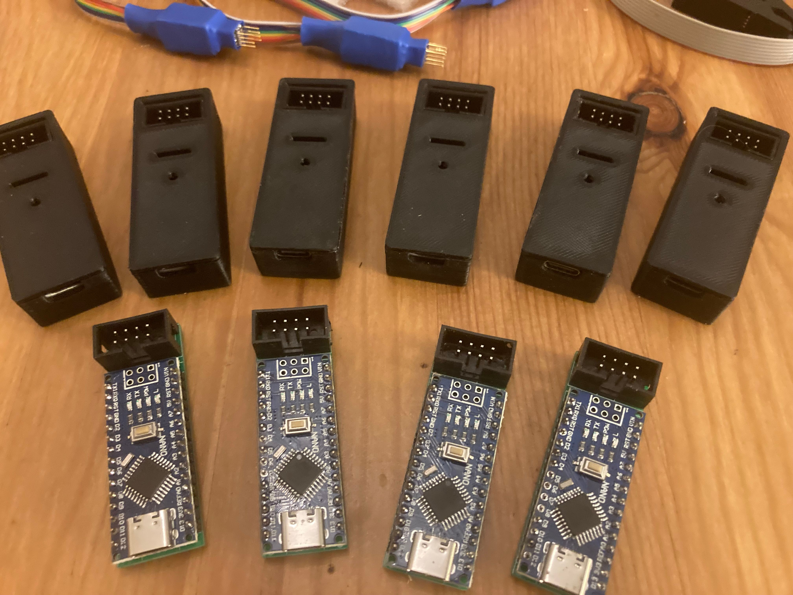

# Saab CIM Tool

## DIY Hardware

* Arduino UNO
* breadboard
* SOP8 clamp + flat cable
* breadboard jumper wires

## Schematics

                          _____
     Chip Select (cs)  --|1   8|--  (pwr) Vcc
    Serial Clock (sk)  --|2   7|--
         Data In (di)  --|3   6|--  (org) Organization Select
        Data Out (do)  --|4   5|--  (gnd) Vss/Ground
                          ¯¯¯¯¯
     Arduino Connection:
       Vcc (pwr)         - Pin 9
       Vss (gnd)         - GND
       Chip Select (cs)  - Pin 10
       Serial Clock (sk) - Pin 7
       Data In (di)      - Pin 11
       Data Out (do)     - Pin 12
       Org Select (org)  - Pin 8

The red cable on the SOP8 clamp indicates pin 1 and should be orinted to the corner marked with a small dot on the EEPROM

       8   7   6   5
     _ | _ | _ | _ | _
    |                 |
    |                 |
    | O               |
     ¯ | ¯ | ¯ | ¯ | ¯
       1   2   3   4

## Update firmware

    ./avr/avrdude.exe -c arduino -P <port> -b 115200 -p atmega328p -D -U flash:w:firmware/firmware.hex:i
